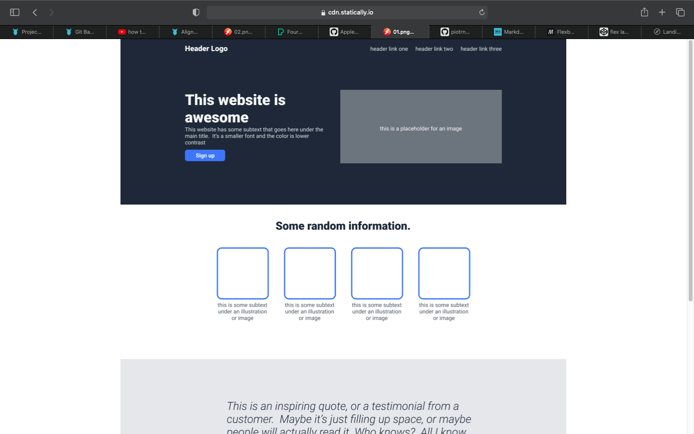
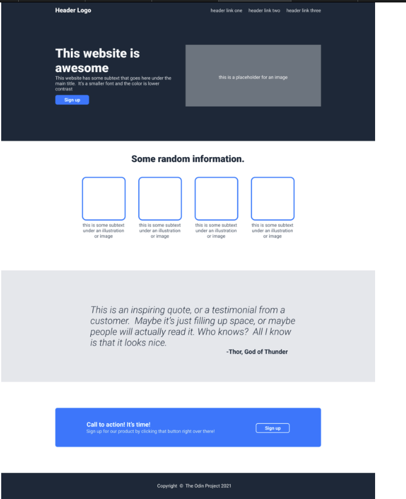
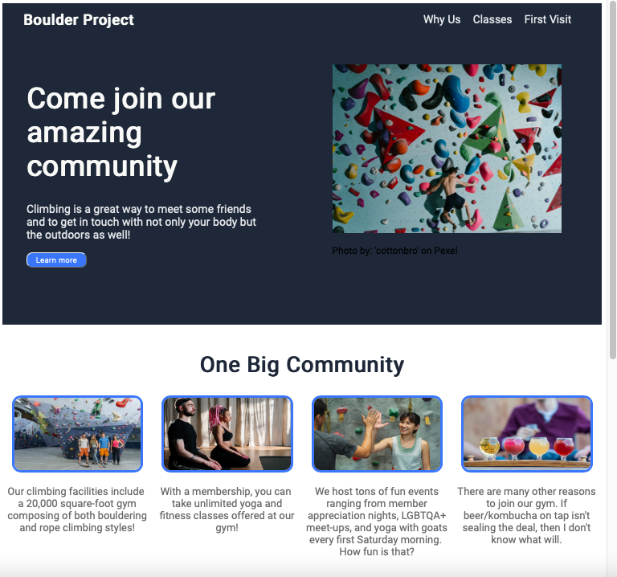
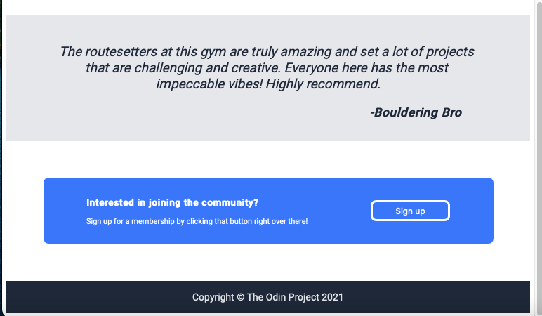

# Landing Page
Built a plain style website to practice my CSS skills. Focused on flexbox properties and basic styling.

## Project Brief
Created a website mimicking a given template by the Odin Project.

My replica of the Odin Project template.

### Things Learned

-How to group sections of code to effectively make a layout wih flexbox
-Curving corners on images and buttons
-Basic CSS styling
